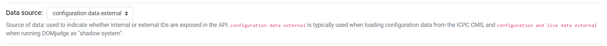

# Contest Tool

## Description

Some useful tools for maintaining contests.

Specifically, this tool is designed to generate two json file for importing into the [DOMjudge](https://www.domjudge.org/) system.

## Usage

```bash
python setup.py
```

Secondly, you need to import the generated json files (teams.json and accounts.json) into the DOMjudge system.

## Note

If you don't set the `datasource` in the config page of DOMjudge, you will get an error.

Please set the `datasource` to `configuration data external` in the config page of DOMjudge.


