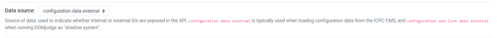
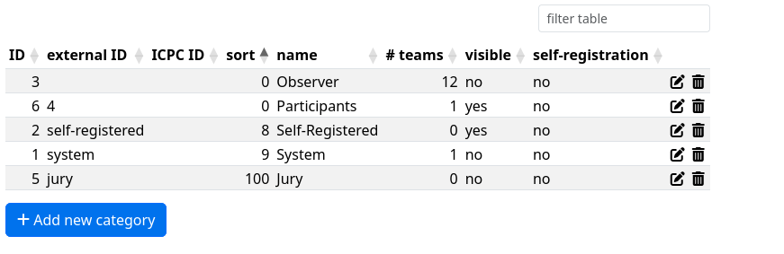

# Contest Tool

## Description

Some useful tools for maintaining contests.

Specifically, this tool is designed to generate two json file for importing into the [DOMjudge](https://www.domjudge.org/) system.

## Usage

Please setup `datasource` in jury page > configuration settings > external systems to `configuration data external` before you import the teams, and accounts.



Then, you need to fill the info of `team.csv` (copy from `sample_team.csv`), the category row must be the external ID of specific category.



Run the command

```bash
python setup.py
```

Secondly, you need to import the generated json files (teams.json and accounts.json respectly) into the DOMjudge system.

`account_info.csv` is for you to check the password of the users.

